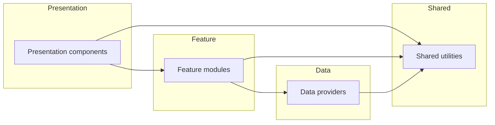

# ADR 0001: Layered module boundaries

## Status
Accepted

## Context
The portfolio mixes desktop chrome, dozens of simulated security tools, retro games, API stubs, and shared utilities. Over time
these areas began to reference one another without guardrails, making it harder to reason about dependencies and to reuse
behaviour across apps without dragging in UI concerns. A documented layer model keeps imports predictable so new contributors can
extend a feature or replace a data source without breaking unrelated surfaces.

## Decision
### Layer definitions
- **Presentation layer** — user-facing shells and layout scaffolding.
  - `app/`: Next.js App Router entries and layout wrappers.
  - `pages/` (excluding `pages/api/`): legacy route components that render windows and app launchers.
  - `components/`: shared UI chrome, app wrappers, menus, and window controls.
  - `styles/`: global Tailwind extensions and CSS modules consumed directly by presentation components.
- **Feature layer** — domain-specific experiences that power each window.
  - `apps/`: implementations of simulated tools, utilities, and games rendered inside desktop windows.
  - `games/`: standalone game logic consumed by feature apps such as the arcade launcher.
  - `modules/`: reusable domain bundles (for example, Metasploit module metadata) that feature apps import.
  - `plugins/`, `workers/`, `player/`, `templates/`, and `pages/api/`: orchestrators, background workers, and API routes that
    deliver feature behaviour to the UI.
- **Data layer** — data access, validation, and service integrations.
  - `lib/`: analytics clients, database shims, fetch utilities, and validation helpers used to talk to external services.
  - `data/`: static JSON, content indexes, and leaderboard payloads shipped with the site.
  - `sql/`: reference SQL queries and schema snapshots.
- **Shared layer** — cross-cutting helpers with no knowledge of upper layers.
  - `hooks/`: reusable state management and platform hooks (focus trap, persisted state, notifications, etc.).
  - `utils/`: generic utilities (storage wrappers, feature flags, analytics helpers) that any layer can adopt.
  - `types/` and `filters/`: shared TypeScript declarations and filter presets consumed throughout the stack.

### Allowed imports
- **Presentation ➜ Feature**: presentation files may import feature modules but not the reverse.
  - Example: `components/apps/terminal.tsx` imports `apps/terminal/tabs` to render the terminal UI.
- **Presentation ➜ Shared**: UI layers rely on hooks and helpers from the shared layer.
  - Example: `components/menu/*` can import `hooks/useFocusTrap` for keyboard navigation.
- **Feature ➜ Data**: feature modules obtain data or service clients from the data layer.
  - Example: `apps/terminal/index.tsx` may import `modules/metadata` for simulated command metadata.
- **Feature ➜ Shared**: feature modules can consume shared hooks and utilities, but shared code must not import feature logic.
  - Example: `apps/terminal/tabs/index.tsx` can use `utils/pubsub` for app-wide events.
- **Data ➜ Shared**: data-layer utilities may depend on shared helpers (for example, logging), but must not import presentation
  or feature code.
  - Example: `lib/service-client.ts` can import `utils/env` for configuration.
- **Shared layer**: shared utilities must remain dependency-free relative to higher layers. They may only import other shared
  assets (for example, `utils/feature.ts` consuming `types/feature.ts`).

Any import that points from a lower layer back up to a higher layer (for example, a hook importing from `components/`) violates
this ADR. Cross-feature imports should route through shared utilities when behaviour must be reused.

### Layer dependency diagram

## Consequences
- New code reviews will reject imports that climb "up" the stack (for example, `hooks/` pulling from `components/`).
- Shared utilities remain lightweight because they cannot depend on feature or presentation concerns.
- Documentation and tooling (ESLint rules, code mods) can rely on the explicit mapping of directories to layers.
