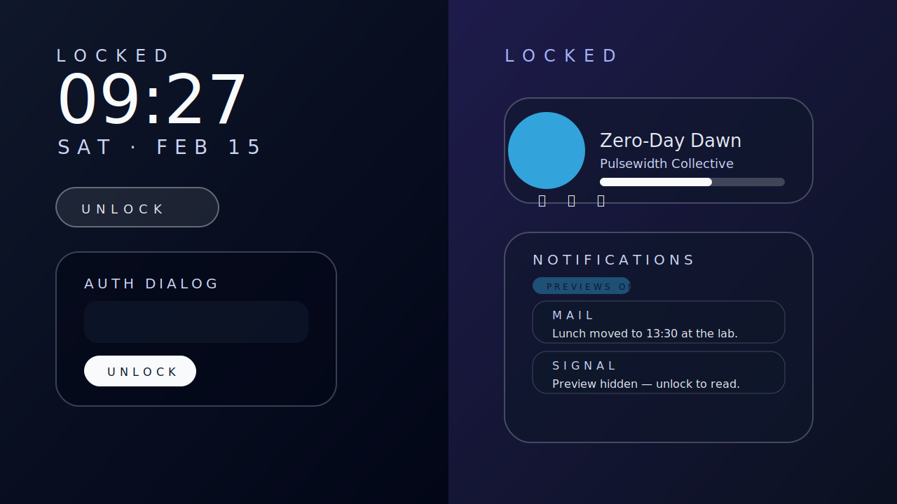

# Design Portal — Lock Screen Refresh

The lock screen now follows a two-column desktop layout that keeps the hero clock
prominent while stacking actionable controls and notification summaries on the side.
This document captures the approved layout, states, and visual guidance for the
implementation in `/pages/lock.tsx`.

## Layout blueprint

- **Clock column** (left)
  - Large, center-aligned clock (`Clock` component) with day/date badge underneath.
  - Instructional copy transitions from “Press any key or click Unlock” to
    “Enter your passcode” once interaction starts.
  - Unlock button emphasises keyboard and pointer parity. When active, a glassmorphism
    dialog slides in with passcode entry, hint copy, and `Escape` handling to dismiss.
- **Info column** (right)
  - `LockControls` renders the media controls card with gradients keyed to the
    current track accent colour.
  - Notifications card uses 12px rounded cells, uppercase app labels, and
    summary/body text sized for readability at DPI breakpoints.

## Interaction notes

- First pointer or keyboard input reveals the authentication sheet; the visible
  button remains for explicit access.
- Passcode form accepts any non-empty value. Success messaging keeps the user on the
  lock screen to reinforce that this is a portfolio simulation.
- `Escape`, the close button, or success state closes the sheet and clears timers.
- Notification previews respect the privacy toggle from **Settings → Privacy**:
  - When previews are disabled, sensitive messages swap to summaries and a banner
    explains that content is hidden until unlock.
  - When enabled, full bodies render but still inherit the privacy badge chip.

## Responsive guidance

- Grid collapses to a single column under `lg:` while maintaining spacing with
  `gap-6` and `px` utilities.
- Text sizes use `sm:` and `md:` overrides to keep the clock legible on tablets
  and high-DPI monitors without overwhelming the viewport.
- Both cards rely on `backdrop-blur` and `bg-white/5` overlays to preserve contrast
  regardless of wallpaper imagery.

## Assets

- `LockControls` lives in `components/apps/media/LockControls.tsx` and exposes props
  for title, artist, album, accent colour, playback state, and callbacks.
- Mockups are vector `.svg` documents stored at `public/docs/mockups/lock-screen-mockups.svg`
  so they can be referenced in additional design documentation without raster loss.
