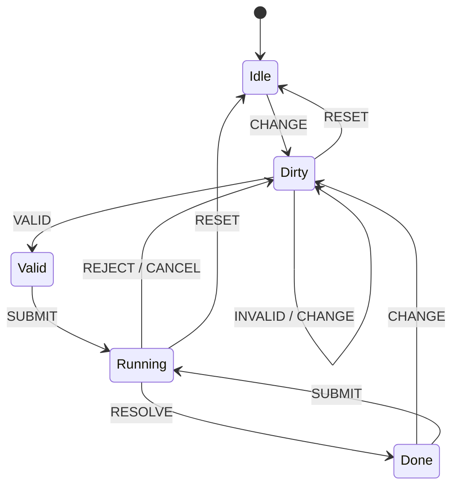

# Form Finite State Machine

The portfolio now centralizes complex form behaviour behind a small finite
state machine located at `utils/fsm/formFSM.ts`. Forms progress through five
states:



Guards prevent `SUBMIT` until the form has reached the `Valid` or `Done`
states. Effects (`submit`, `success`, `error`, `reset`) fire when transitions
occur so components can coordinate side effects such as API calls.

## Hook usage

Use the `useFormFSM` hook to wire the state machine into a component:

```tsx
import useFormFSM from '../../hooks/useFormFSM';

const ExampleForm = () => {
  const form = useFormFSM();

  form.useSubmitEffect(() => {
    // run your async side effect and resolve or reject
    form.resolve({ ok: true });
  });

  return (
    <form
      onSubmit={(event) => {
        event.preventDefault();
        form.validate();
        form.submit(new FormData(event.currentTarget));
      }}
    >
      <input onChange={() => form.change()} />
      {form.error && <p role="alert">{form.error}</p>}
      <button disabled={!form.state.canSubmit || form.state.isBusy}>Save</button>
    </form>
  );
};
```

Key steps:

1. Call `form.change()` on user edits to move into the `Dirty` state.
2. When validation passes, call `form.validate()`; if validation fails use
   `form.invalidate(message)` to surface errors.
3. Call `form.submit(payload)` to enter the `Running` state. Use
   `form.useSubmitEffect` to trigger the asynchronous side effect. Finish with
   `form.resolve(result)` or `form.reject(message)`.
4. Optional hooks `useSuccessEffect`, `useErrorEffect`, and `useResetEffect`
   let you react when the machine resolves, fails, or resets.

Hydra and Nmap now rely on this flow to avoid stuck states between retries.
When extending other forms, reuse the same pattern for consistent UX and test
coverage.
