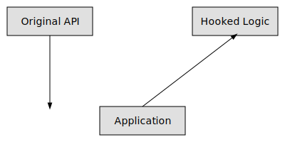

# HookGraph

This document explains the basics of API hooking using a local HookGraph diagram.



The diagram shows how an application call is intercepted by a hook that injects custom logic before passing control to the original API.

```js
// Example of intercepting a function call. This code is for illustration only
// and is not operational.
const originalSend = socket.send;
socket.send = function (...args) {
  console.log('send intercepted', args);
  // originalSend.apply(this, args);
};
```

Hooks should only be experimented with in controlled environments.
